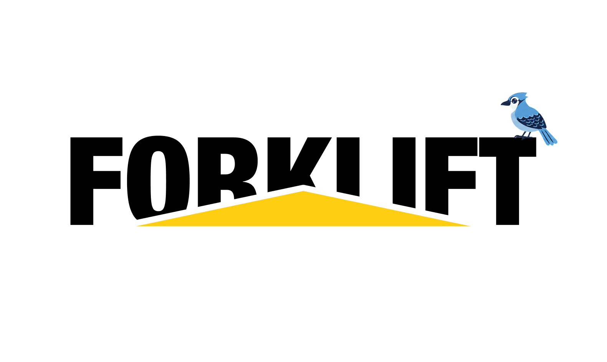

<div align="center">
  <a href="https://github.com/rivet-dev/jj-forklift">
    
  </a>
  <br/>
  <h3>A Jujutsu-native stacked PR workflow.</h3>
  <p>Fast local stack submit, sync, merge, and handoff for GitHub.</p>
  <p>
    <a href="#install">Install</a> •
    <a href="#quickstart">Quickstart</a> •
    <a href="#fundamentals">Fundamentals</a> •
    <a href="#related-tools">Related tools</a>
  </p>
</div>

Forklift for Jujutsu is a small, low-intrusive Rust CLI for a Jujutsu-native
stacked PR workflow, inspired by [Graphite](https://graphite.dev). It assumes
your jj changes form a single bottom-to-top stack, where each change becomes
one pull request.

- **Fast:** get out of the developer's way with the bare minimum of waiting. Merges land directly, with no merge queues by design.
- **Jujutsu-friendly workflow:** focus on editing existing revisions, no extra bloat.
- **Collaboration:** built for clear collaboration. Freeze changes you don't own and keep editing your existing stacks safely.
- **GitHub-friendly:** print friendly information for navigating from GitHub.

## Prerequisites

- [Jujutsu (`jj`)](https://github.com/jj-vcs/jj) installed and a colocated repo.
- [GitHub CLI (`gh`)](https://cli.github.com) installed and authenticated
  (`gh auth login`).

## Install

Install from Git:

```text
cargo install --git https://github.com/rivet-dev/jj-forklift.git
```

## Quickstart

The core loop:

1. **`jj new`** to start a new change on top of your stack.
2. **Make your edits**: jj tracks the working copy automatically.
3. **`jj describe`** to set the change's message.
4. **`forklift submit`** to push your stack as pull requests.
5. **`forklift merge`** to land your stack.

Two other commonly used commands:

- **`forklift get <target>`** to fetch an existing stack to work on.
- **`forklift sync`** to pull in the latest changes and rebase onto main as work
  lands around you.

## Coming from Graphite

If you already know the Graphite CLI (`gt`), here is how its commands map to
jj and Forklift for Jujutsu:

| Graphite (`gt`)          | jj / Forklift      |
| ------------------------ | ------------------ |
| `gt create`              | `jj new`           |
| `gt checkout`            | `jj edit`          |
| `gt move` / `gt restack` | `jj rebase`        |
| `gt modify -m`           | `jj describe`      |
| `gt get`                 | `forklift get`     |
| `gt sync`                | `forklift sync`    |
| `gt submit`              | `forklift submit`  |
| `gt merge`               | `forklift merge`   |

**What you gain:**

- **Instant merges:** stacks land directly by fast-forwarding trunk, with no merge queue to wait on.
- **Automatic restacks:** jj rebases your whole stack for you; no manual `gt restack` after every change.
- **Fast, conflict-free rebases:** jj records conflicts in the commit instead of halting the rebase, so restacks always finish and you resolve on your own time.
- **Edit in place:** edit any revision directly with `jj edit`; descendants restack automatically.
- **Undo anything:** `jj undo` and the operation log reverse any command, including merges and rebases.
- **Open source:** no proprietary SaaS, no login, no per-seat billing.

**What you give up:**

- **Merge queues:** there is no hosted, stack-aware merge queue; merges land locally by fast-forward.
- **The Graphite dashboard:** no web UI for browsing or reviewing stacks; you navigate from GitHub instead.

## Fundamentals

### Jujutsu fundamentals

You build and edit stacks with plain jj. Forklift for Jujutsu never replaces
these.

**`jj new <rev>`**
Start a new change on top of `<rev>`.

**`jj edit <rev>`**
Move into an existing revision to edit it.

**`jj rebase ...`**
Restructure or move changes.

**`jj describe <rev>`**
Set a change's message.

### Forklift Commands

**`forklift get <target>`**
Get or fetch an existing stack locally. The target can be a PR number (`123`), a
PR URL, an exact PR head branch, or a jj change-id prefix embedded in a stack
branch.

**`forklift sync`**
Fetch the latest changes and rebase onto main.

**`forklift submit`**
Push your changes as pull requests.

**`forklift merge`**
Merge your changes, starting from the current rev.

**`forklift pr`**
Open the current PR in your browser.

### Freezing

Freezing prevents you from clobbering other users' changes. You cannot edit
revisions owned by other users, and imported or collaborator-owned changes are
frozen automatically.

**`forklift freeze`**
Manually freeze a revision.

**`forklift unfreeze`**
Manually take ownership of a frozen revision you can push to.

## Related tools

Forklift for Jujutsu targets shared stacks: it merges a whole stack from the CLI
by fast-forwarding trunk and freezes revisions you don't own, with no merge
queue. How the jj-native tools compare:

| Tool | Merge | Speed | Multi-PR | Collaboration\* | Auth |
| ---- | ----- | ----- | -------- | --------------- | ---- |
| **Forklift for Jujutsu** | **CLI, FF trunk** | **fast; no queue or CI gate** | **whole stack, one command** | **ownership freeze + handoff** | **`gh`, no token** |
| [jj-spr](https://github.com/jennings/jj-spr) | CLI, squash via API | fast; local squash | one at a time, manual rebase | none | token, `repo` scope |
| [jjpr](https://github.com/michaeldhopkins/jjpr) | CLI, forge API | medium; waits on CI | bottom-up | targets a coworker's branch | `gh`/`glab` or token |
| [jj-ryu](https://github.com/dmmulroy/jj-ryu) | GitHub web UI | fast submit, manual merge | merge each PR yourself | none | `gh`/`glab` or token |
| [jj-vine](https://codeberg.org/abrenneke/jj-vine) | GitHub web UI | fast submit, manual merge | not built yet | none | token in config |
| [keanemind/jj-stack](https://github.com/keanemind/jj-stack) | GitHub web UI | fast submit, manual merge | merge bottom, then rerun | none | `gh` or token |

\* *Collaboration* = a managed ownership model for shared stacks: import a
teammate's stack and keep their revisions frozen until you explicitly take them
over. **none** = no such model; jj's default only marks untracked remote
bookmarks immutable, which stops protecting once you track the branch.

In the Git world, the analogous tools are [Graphite](https://graphite.dev),
[spr](https://github.com/ejoffe/spr), and
[ghstack](https://github.com/ezyang/ghstack).

## License

Licensed under the Apache License, Version 2.0. See [LICENSE](LICENSE).
